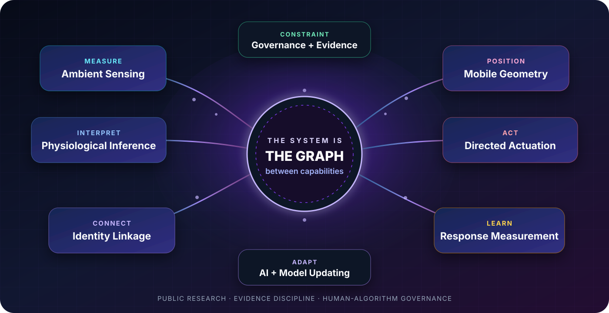
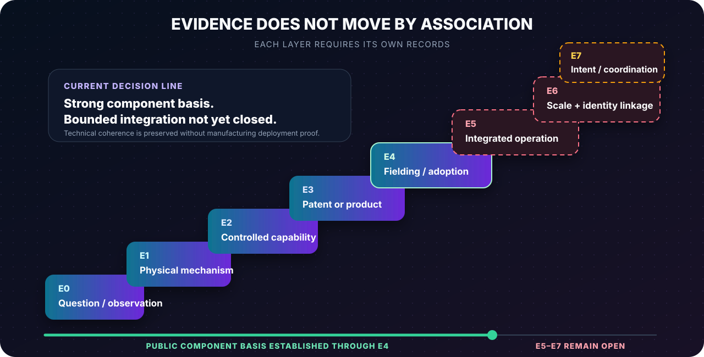
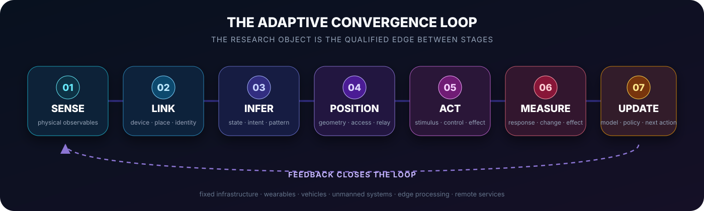
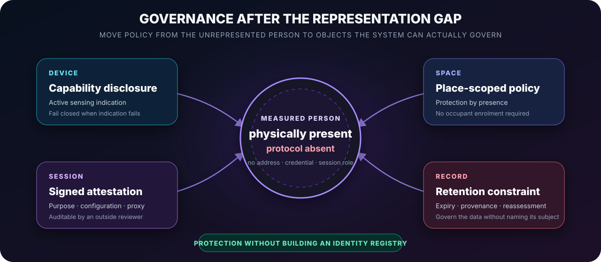

<p align="center">
  
</p>

<h1 align="center">CONVERGENCE ARCHITECTURE</h1>

<p align="center">
  <strong>Evidence-controlled public research on sensing, inference, mobility, actuation, adaptation, and human-algorithm governance</strong>
</p>

<p align="center">
  
  
  
  
</p>

> **The system is not one machine. It is the graph between machines.**

Convergence Architecture is a public research and evidence-navigation system developed by **Marc Tuinier at MT Tech Industries LLC**. It maps how independently developed capabilities in contactless sensing, identity linkage, physiological inference, mobile geometry, artificial intelligence, directed actuation, response measurement, and adaptive control can form a distributed human-facing architecture.

This repository does not treat technical compatibility as deployment proof. It exposes the source records, atomic claims, qualified pathways, evidence states, constraints, corrections, and next records required to advance a conclusion.

## Release `0.4.0`: actual evidence portal

The root [`index.html`](index.html) is now a data-driven application rather than a hard-coded collection of summary cards.

It reads the version-controlled public registry in [`data/`](data/) and derives its counts, charts, filters, graph, and linked record views from those files.

### Registered corpus

| Registry | Total | Public | Restricted placeholders |
|---|---:|---:|---:|
| Sources | 30 | 29 | 1 |
| Claims | 30 | 28 | 2 |
| Pathways | 20 | 18 | 2 |
| Research trunks | 15 | 15 | 0 |
| Active corrections | 1 | 1 | 0 |

Restricted placeholders preserve canonical record IDs, counts, and referential integrity without exposing private testimony, access paths, protected methods, or controlled evidence.

## Portal capabilities

The public portal includes:

- unified full-corpus search across sources, claims, pathways, and trunks;
- independent source, claim, and pathway registries;
- filters for evidence state, trunk, visibility, type, year, status, and reachability;
- sortable, paginated result sets;
- linked record drawers showing source-to-claim and source-to-pathway relationships;
- copyable deep links to individual records;
- filtered CSV and JSON export;
- an interactive architecture graph generated from the pathway registry;
- evidence-distribution, source-timeline, and trunk-coverage charts derived at runtime;
- active correction records and release history;
- dark and light themes, responsive navigation, keyboard search, and reduced-motion support;
- runtime integrity checks plus repository validation in GitHub Actions.

No Tailwind CDN, icon CDN, Google Fonts dependency, or external application framework is required. The portal is plain HTML, CSS, JavaScript, CSV, and JSON.

## Current decision state

```text
PUBLIC COMPONENT BASIS: STRONG, MULTI-DOMAIN, AND AERIALLY EXTENDED
TECHNICAL CONVERGENCE: THE RESEARCH OBJECT
INTEGRATED CASE CLOSURE: OPEN
EVENT-SPECIFIC ATTRIBUTION: REQUIRES BOUNDED RECORDS
```

The public corpus establishes component mechanisms, controlled capabilities, patents, products, institutional fielding, aerial sensing, mobile relay, AI interpretation, and governance recognition across multiple domains.

It does not automatically establish one identity-linked, persistent, strategically directed closed-loop deployment. That requires the records specified by the evidence and pathway registries.

## Evidence architecture

<p align="center">
  
</p>

| State | Required meaning |
|---|---|
| `E0` | Question, testimony, raw observation, or integration hypothesis |
| `E1` | Physical or formal mechanism established |
| `E2` | Laboratory or controlled capability demonstrated |
| `E3` | Patent, named product, or commercial capability documented |
| `E4` | Institutional procurement, fielding, deployment, or normative adoption documented |
| `E5` | Cross-domain integration documented in one bounded system |
| `E6` | Scale, persistence, identity linkage, or retention documented |
| `E7` | Strategic intent, command, coordination, payment, or mission directly evidenced |

```text
CAPABILITY ≠ DEPLOYMENT
DEPLOYMENT ≠ INTEGRATION
INTEGRATION ≠ PERSISTENCE OR IDENTITY LINKAGE
PERSISTENCE OR IDENTITY LINKAGE ≠ INTENT
TECHNICAL COHERENCE ≠ EVENT-SPECIFIC ATTRIBUTION
NON-VERIFICATION ≠ NEGATION
PRESERVATION ≠ INDEPENDENT CORROBORATION
```

Read the full rules in [`evidence/EVIDENCE_STANDARD.md`](evidence/EVIDENCE_STANDARD.md).

## Adaptive architecture

<p align="center">
  
</p>

```text
SENSE
  → IDENTIFY OR LINK
  → INFER STATE OR INTENT
  → POSITION
  → SELECT OR DELIVER AN ACTION
  → MEASURE RESPONSE
  → UPDATE THE MODEL
```

The research question is not whether every stage exists in isolation. It is which edges are physically reachable, which are documented, which operate together, and what records establish identity linkage, persistence, adaptation, and intent.

## Public data model

```text
data/
├── metadata.json           release, counts, evidence date, decision state
├── evidence-levels.json    E0–E7 definitions
├── trunks.csv              15 public-safe research trunks
├── sources.csv             30 source records and support boundaries
├── claims.csv              30 atomic claims and counterevidence fields
├── pathways.csv            20 qualified cross-trunk pathways
├── corrections.csv         active correction register
└── README.md               registry and validation documentation
```

### Source records include

- source identity, title, type, author or organization, date, and URL;
- connected research trunks;
- evidence layers supported;
- reliability notes and non-claim boundaries;
- key contribution, access status, status, and update date.

### Claim records include

- one atomic claim;
- claim class, evidence state, and confidence;
- supporting source IDs;
- boundary or counterevidence;
- deployment status, intent status, next action, and visibility.

### Pathway records include

- source and target trunks;
- physical or digital mechanism;
- required infrastructure;
- reachability `R0–R7` and evidence `E0–E7`;
- known constraints, integration question, and test or record needed.

## Validation

The repository includes a dependency-free validator:

```bash
python3 scripts/validate_public_data.py
for file in assets/js/portal-*.js; do node --check "$file"; done
```

The validator checks unique IDs, source and trunk references, correction links, evidence values, reachability values, visibility, URL structure, and metadata counts.

GitHub workflow: [`.github/workflows/validate-public-portal.yml`](.github/workflows/validate-public-portal.yml)

## Research documents

| Document | Function |
|---|---|
| [`research/CONVERGENCE_ARCHITECTURE.md`](research/CONVERGENCE_ARCHITECTURE.md) | Primary technical synthesis |
| [`research/AERIAL_AMBIENT_SENSING_EXTENSION.md`](research/AERIAL_AMBIENT_SENSING_EXTENSION.md) | UAV, thermal, CSI, and mobile-infrastructure extension |
| [`research/REPRESENTATION_GAP.md`](research/REPRESENTATION_GAP.md) | Representation Gap, Representation Paradox, identity-indeterminate measurement |
| [`governance/PROTOCOL_GOVERNANCE.md`](governance/PROTOCOL_GOVERNANCE.md) | Device-, space-, session-, and record-level governance mechanisms |
| [`evidence/EVIDENCE_STANDARD.md`](evidence/EVIDENCE_STANDARD.md) | Evidence advancement and non-collapse rules |
| [`evidence/CURRENT_STATUS.md`](evidence/CURRENT_STATUS.md) | Current public decision snapshot |
| [`references/PRIMARY_SOURCE_STARTER.md`](references/PRIMARY_SOURCE_STARTER.md) | Primary-source starting map |
| [`PUBLICATION_BOUNDARY.md`](PUBLICATION_BOUNDARY.md) | Public/private/commercial custody boundary |

## Governance after the Representation Gap

<p align="center">
  
</p>

The public governance work relocates policy to objects that systems can represent without requiring compulsory person registration:

- **Device:** capability disclosure and active sensing indication.
- **Space:** signed, machine-readable sensing policy attached to a physical volume.
- **Session:** attested initiator, purpose, configuration, proxy relationship, and interval.
- **Record:** provenance, retention limits, deletion, derivation constraints, and reassessment.

The proposal binds compliant infrastructure. It does not claim to constrain a passive external observer executing no protocol.

## Publication boundary

Published here:

- public technical syntheses;
- public-safe source, claim, pathway, correction, and trunk records;
- evidence distinctions, governance proposals, diagrams, and falsification requirements.

Deliberately withheld:

- private testimony, identifying records, access paths, and Drive links;
- protected mathematics, weights, thresholds, calibration constants, and signatures;
- private graph-extraction logic and deployment-specific validation sequences;
- pricing, outreach scripts, buyer targeting, and commercial offer design.

See [`PUBLICATION_BOUNDARY.md`](PUBLICATION_BOUNDARY.md).

## Authorship and citation

Research developed by **Marc Tuinier at MT Tech Industries LLC**.

Digital Dichotomy publications are attributed to **Fin Nyx** where explicitly marked. Repository location does not collapse technical, evidentiary, publication, or commercial identities.

Citation metadata: [`CITATION.cff`](CITATION.cff)

## Rights

Copyright © 2026 MT Tech Industries LLC. All rights reserved.

Public access does not place this material in the public domain and does not grant an open-source or open-content license unless a specific file states otherwise.
